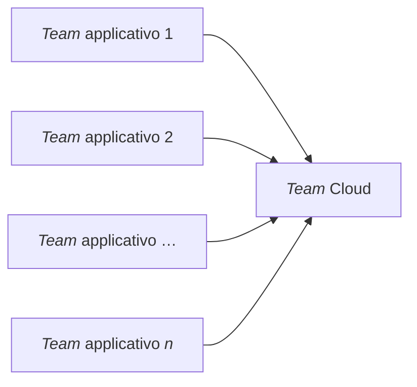

Consideriamo una grande azienda, al cui interno è presente (come molto spesso succede) un *team* che si occupa di gestire i suoi ambienti Azure, che ha il compito di istruire i *team* di sviluppo applicativo su come “consumare” Azure nel modo corretto, magari inviandogli un diagramma fatto in Microsoft Visio e chiedendogli di replicarlo.

La situazione, quindi, è la seguente:

Come si vede, questo “flusso” crea un **collo di bottiglia** e durante l’implementazione degli ambienti i *team* applicativi possono commettere errori. La creazione di un ambiente Cloud, infatti, può essere un processo lungo ed è soggetto a errori.

[[Azure Blueprints]] risponde a questo problema: “impacchetta” tutto ciò che serve in un *blueprint* facilmente utilizzabile dai *team* applicativi quando hanno bisogno di creare un nuovo ambiente, che sia per *test*, *staging* o *production*. Ciò consente agli sviluppatori di dislocare e aggiornare ambienti Cloud in modo **ripetibile**, mediante artefatti come *policy*, *role-based access control* (RBAC) e [[ARM template]], con la confidenza di star operando all’interno dei requisiti previsti.

## Qual è la differenza con gli ARM Template

Gli [[ARM template]] indicano in modo dichiarativo come dev’essere una risorsa. Tuttavia, in ambienti di grandi dimensioni, gestire l’infrastruttura con solo ARM template non è semplice. Ci sono modi per orchestrare [[ARM template]] insieme, ma si finisce con dei monoliti difficili da gestire e *debuggare*.

Gli [[Azure Blueprints]] risolvono questo problema, ossia consentono di “impacchettare” insieme tutto ciò che serve in una determinata infrastruttura, di versionarlo e poterlo replicare con facilità.

In sostanza, [[Azure Blueprints]] è un *“superset”* che contiene tutto ciò che serve, inclusi gli [[ARM template]].
