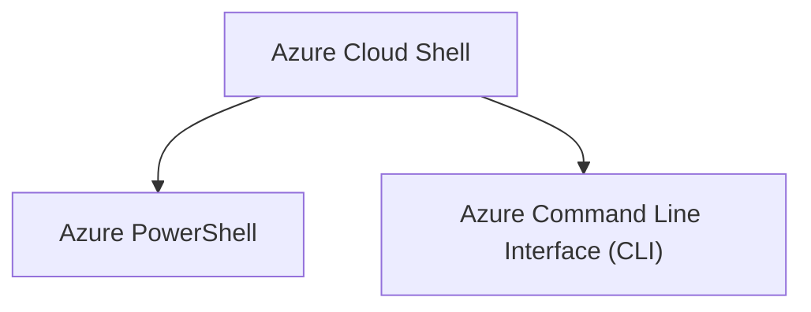

Strumento *shell* basato su *browser* che consente di creare, configurare e gestire [[Azure Resource]] usando una *shell*. Supporta sia [[Azure PowerShell]] che [[Azure Command Line Interface (CLI)]], che è una *shell* Bash. Vi si accede tramite [[Azure Portal]], selezionando l’apposita icona:

![[Pasted image 20230226161625.png]]

Ha diverse funzionalità che la rendono adatta per supportare nella gestione di Azure. Alcune di queste caratteristiche sono:

1. È una *shell* disponibile direttamente nel *browser*, senza necessità di installazione o configurazione in locale.
2. È autenticato con le tue credenziali di Azure, conscio di chi si è e quali autorizzazioni si ha.
3. È possibile scegliere la *shell* con cui si ha più familiarità, dato che supporta sia [[Azure PowerShell]] sia [[Azure Command Line Interface (CLI)]] (che usa Bash).