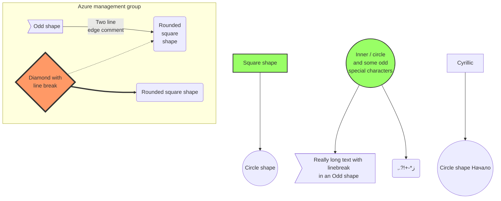

Tradotto in Italiano con “Area geografica di Azure”, rappresenta un‘area geografica del mondo con un mercato distinto, che contiene una o più [[Azure Region]] e che rispetta specifici requisiti di residenza dei dati e conformità. Questo approccio ti permette di mantenere nelle vicinanze i dati e le app cruciali in un'infrastruttura di rete con tolleranza di errore e capacità elevata. Non a caso, le [[Azure Geography]] attualmente esistenti sono sono relative a ben determinati paesi, come la [[Azure Geography]] Africa, Italia, India, etc.

Azure Geographies are areas of the world where Azure is available. Each Azure Geography contains one or more Azure Regions. Azure Regions are individual datacenter locations within a geography. They are made up of a combination of multiple datacenters, which are typically located within a few hundred miles of each other within the same geographic area.  
Paired regions refer to the concept of having two Azure regions within the same geography that are paired for resiliency and redundancy. These pairs are chosen such that the data and services in one region can be replicated to the paired region for disaster recovery purposes.  
Availability zones are physically separate datacenters within an Azure region. They are designed to provide fault tolerance and high availability by ensuring that services run in multiple zones, thereby protecting against individual datacenter failures. Each availability zone is typically housed in a different building, with independent power, cooling, and networking infrastructure.

