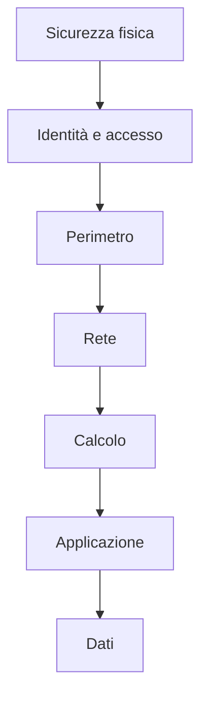

Approccio che mira a proteggere ciò che più conta nel panorama *software*, ossia le **informazioni** e i **dati**, disseppellendoli sotto una piramide di strati per renderne via via più difficile la violazione da parte di estranei, rallentando quanto più possibile (con la speranza di fermare) l’avanzamento di un **attacco** che mira a rubare i dati.

Con questo approccio, si elimina la singola dipendenza da un livello di protezione specifico e si possono fornire svariate informazioni, livello per livello, su cui gli addetti alla sicurezza possono agire, automaticamente o manualmente.

# Sicurezza fisica
Bisogna garantire la sicurezza dei ***data center*** e dell’***hardware*** ivi custodito.

# Identità e accesso
Bisogna garantire che le identità delle persone che accedono alle infrastrutture siano **sicure**, che l’accesso sia consentito solo per ciò che è **necessario** e che gli eventi di accesso e le modifiche vengano **registrati**. Strumenti vantaggiosi che possono essere applicati sono il [[Single Sign-On (SSO)]] e la [[Multi-factor authentication (MFA)]].

# Perimetro
Bisogna proteggere le risorse dagli attacchi in **rete**. Identificare gli attacchi, eliminarne l’impatto e avvisare quando questi si verificano sono azioni importanti per proteggere la rete. Strumenti vantaggiosi che possono essere applicati sono la **protezione** **DDoS** e i ***firewall* perimetrali**.

# Rete
Bisogna limitare la **connettività** di rete tra tutte le risorse, al fine di consentire solo ciò che è necessario. Si riduce così il rischio che un attacco si diffonda ad altri sistemi che appartengono alla medesima rete. Approcci vantaggiosi che possono essere usati sono:
- **Negare** per impostazione predefinita.
- Limitare l’accesso a Internet in **entrata** e limitare l'accesso in **uscita** ove appropriato.
- Implementare la connettività sicura alle reti locali.

# Calcolo
Bisogna rendere sicure le risorse di calcolo e adottare le giuste misure di sicurezza; nello specifico, è importante proteggere l’accesso alle [[Virtual Machine]], implementare la protezione degli ***endpoint*** sui *device* e mantenere i sistemi **aggiornati** e corretti **mediante** *patch*.

# Applicazione
Bisogna integrare la sicurezza nel ciclo di sviluppo *software* per ridurre il numero di vulnerabilità introdotte nel codice. Le applicazioni devono essere sicure per *default*. È altresì importante memorizzare i dati sensibili in un mezzo di memorizzazione affidabile e rendere la sicurezza un requisito di design.

# Dati
Bisogna proteggere i dati. Spesso sono requisiti di regolamentazione a dettare i controlli e i processi da attuare per soddisfare la confidenzialità, l'’integrità e la disponibilità dei dati. In quasi tutti i casi, gli “attaccanti” sono interessati ai dati memorizzati nei *database*, nei discjhi delle [[Virtual Machine]], memorizzati nelle aplicazioni Saas (come Office 365) e quelli gestiti tramite lo storage Cloud.